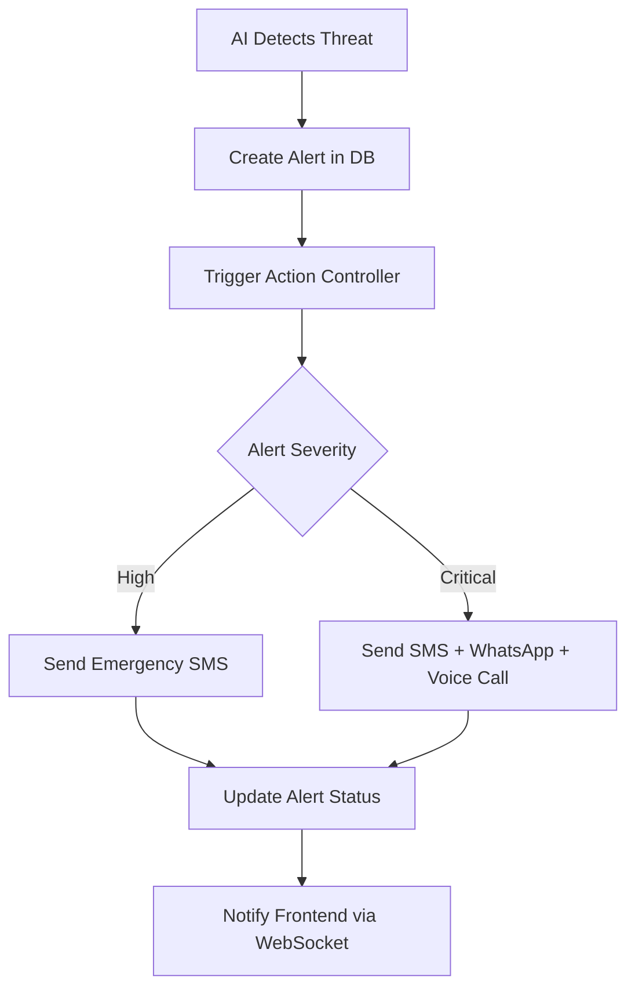
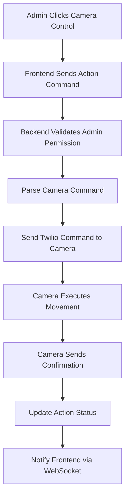
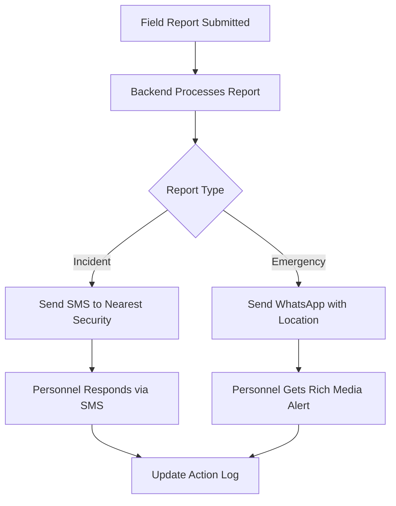

# 📱 **TWILIO INTEGRATION WORKFLOW**
## CrowdShield AI - Communication & Camera Control System

---

## 🎯 **Overview**

Twilio integration in CrowdShield AI serves multiple communication purposes:
1. **SMS Notifications** - Alert broadcasting to security personnel
2. **WhatsApp Messaging** - Enhanced communication with multimedia support
3. **Camera Control Commands** - Remote CCTV system management
4. **Emergency Communications** - Critical incident response workflow

---

## 🏗️ **Current Architecture**

### Backend Implementation Status:
```
✅ SMS Service Structure: src/services/sms.service.js (Stub)
✅ WhatsApp Service Structure: src/services/whatsapp.service.js (Stub)
✅ Integration Points: src/controllers/actions.controller.js
🔲 Twilio SDK Implementation: Needs setup
🔲 Camera Control API: Needs development
```

### Integration Points:
- **Actions Controller**: Triggers SMS/WhatsApp when security actions contain keywords
- **Alert System**: Can send emergency notifications via Twilio
- **Camera Operations**: Remote control through Twilio voice/messaging commands

---

## 📡 **CAMERA CONTROL WORKFLOW**

### 1. **Frontend to Backend Camera Commands**
```javascript
// Frontend sends camera control action
POST /api/v1/actions
{
  "command": "camera:rotate:zone-A:left",
  "zoneId": "zone-A",
  "metadata": {
    "cameraId": "cam-001",
    "direction": "left",
    "angle": 45
  }
}
```

### 2. **Backend Processing & Twilio Integration**
```javascript
// actions.controller.js processes the command
if (command.includes('camera:')) {
  // Parse camera command
  const [action, operation, zone, direction] = command.split(':');
  
  // Send Twilio command to camera system
  await sendSms(cameraPhoneNumber, `CMD:${operation}:${direction}:${angle}`);
  
  // OR send to camera control service
  await twilioVoiceCall(cameraSystemNumber, {
    operation: operation,
    zone: zone,
    direction: direction
  });
}
```

### 3. **Camera System Response Flow**
```
Frontend Command → Backend API → Twilio SMS/Voice → Camera Controller → Physical Camera
                                      ↓
Frontend Status ← WebSocket ← Backend ← Twilio Webhook ← Camera Confirmation
```

---

## 🔄 **TWILIO COMMUNICATION WORKFLOWS**

### **Workflow 1: Emergency Alert Broadcasting**


### **Workflow 2: Remote Camera Control**


### **Workflow 3: Field Personnel Communication**


---

## 🛠️ **IMPLEMENTATION DETAILS**

### **Frontend Integration Points**

#### 1. **Camera Control Panel**
```javascript
// Frontend camera control component
const sendCameraCommand = async (cameraId, operation, direction) => {
  const response = await fetch('/api/v1/actions', {
    method: 'POST',
    headers: {
      'Authorization': `Bearer ${jwt}`,
      'Content-Type': 'application/json'
    },
    body: JSON.stringify({
      command: `camera:${operation}:${cameraId}:${direction}`,
      zoneId: getCurrentZoneId(),
      metadata: {
        cameraId,
        operation,
        direction,
        timestamp: Date.now()
      }
    })
  });
  
  // Real-time status updates via WebSocket
  socket.on('action:camera:response', (data) => {
    updateCameraStatus(data);
  });
};
```

#### 2. **Emergency Alert Panel**
```javascript
// Frontend emergency communication
const sendEmergencyAlert = async (alertData) => {
  const response = await fetch('/api/v1/actions', {
    method: 'POST',
    headers: {
      'Authorization': `Bearer ${jwt}`,
      'Content-Type': 'application/json'
    },
    body: JSON.stringify({
      command: `emergency:broadcast:${alertData.severity}`,
      zoneId: alertData.zoneId,
      metadata: {
        message: alertData.message,
        coordinates: alertData.location,
        mediaUrls: alertData.attachments
      }
    })
  });
};
```

### **Backend Implementation**

#### 1. **Enhanced SMS Service**
```javascript
// src/services/sms.service.js - Full Implementation
const twilio = require('twilio');
const client = twilio(process.env.TWILIO_ACCOUNT_SID, process.env.TWILIO_AUTH_TOKEN);

async function sendSms(to, body, mediaUrls = []) {
  try {
    const message = await client.messages.create({
      body: body,
      from: process.env.TWILIO_PHONE_NUMBER,
      to: to,
      mediaUrl: mediaUrls
    });
    return { ok: true, messageId: message.sid };
  } catch (error) {
    console.error('SMS Error:', error);
    return { ok: false, error: error.message };
  }
}

async function sendCameraCommand(cameraPhoneNumber, command, metadata) {
  const commandString = `CMD:${command}:${JSON.stringify(metadata)}`;
  return await sendSms(cameraPhoneNumber, commandString);
}

module.exports = { sendSms, sendCameraCommand };
```

#### 2. **Enhanced WhatsApp Service**
```javascript
// src/services/whatsapp.service.js - Full Implementation
const twilio = require('twilio');
const client = twilio(process.env.TWILIO_ACCOUNT_SID, process.env.TWILIO_AUTH_TOKEN);

async function sendWhatsApp(to, body, mediaUrls = []) {
  try {
    const message = await client.messages.create({
      body: body,
      from: `whatsapp:${process.env.TWILIO_WHATSAPP_NUMBER}`,
      to: `whatsapp:${to}`,
      mediaUrl: mediaUrls
    });
    return { ok: true, messageId: message.sid };
  } catch (error) {
    console.error('WhatsApp Error:', error);
    return { ok: false, error: error.message };
  }
}

module.exports = { sendWhatsApp };
```

#### 3. **Enhanced Actions Controller**
```javascript
// src/controllers/actions.controller.js - Camera Integration
const { sendSms } = require('../services/sms.service');
const { sendWhatsApp } = require('../services/whatsapp.service');

async function createAction(req, res) {
  const { command, zoneId, metadata = {} } = req.body;
  
  // Camera control commands
  if (command.startsWith('camera:')) {
    const [action, operation, cameraId, direction] = command.split(':');
    const cameraPhoneNumber = await getCameraPhoneNumber(cameraId);
    
    const result = await sendSms(cameraPhoneNumber, 
      `CMD:${operation}:${direction}:${metadata.angle || 0}`);
    
    if (result.ok) {
      // Log action and notify frontend
      const actionRecord = await Action.create({
        command,
        zoneId,
        createdBy: req.user.id,
        metadata: { ...metadata, messageId: result.messageId },
        status: 'sent'
      });
      
      // Notify frontend via WebSocket
      req.io.emit('action:created', actionRecord);
      return res.json({ success: true, action: actionRecord });
    }
  }
  
  // Emergency broadcast commands
  if (command.startsWith('emergency:')) {
    const recipients = await getEmergencyContacts(zoneId);
    const promises = recipients.map(contact => {
      if (contact.preferredMethod === 'whatsapp') {
        return sendWhatsApp(contact.phone, metadata.message, metadata.mediaUrls);
      } else {
        return sendSms(contact.phone, metadata.message);
      }
    });
    
    const results = await Promise.all(promises);
    // Process results and update action log
  }
  
  // ... rest of existing logic
}
```

---

## 🔧 **CAMERA CONTROL COMMANDS**

### **Supported Camera Operations**
| Command Format | Description | Twilio Message |
|----------------|-------------|----------------|
| `camera:rotate:cam-001:left` | Rotate camera left | `CMD:rotate:left:45` |
| `camera:zoom:cam-001:in` | Zoom camera in | `CMD:zoom:in:2x` |
| `camera:preset:cam-001:position-1` | Move to preset | `CMD:preset:position-1` |
| `camera:record:cam-001:start` | Start recording | `CMD:record:start:60min` |
| `camera:snapshot:cam-001:now` | Take snapshot | `CMD:snapshot:now` |

### **Camera Response Handling**
```javascript
// Webhook endpoint for camera confirmations
app.post('/webhooks/twilio/camera-response', (req, res) => {
  const { From, Body } = req.body;
  
  if (Body.startsWith('CONFIRM:')) {
    const [status, operation, result] = Body.split(':');
    
    // Update action status in database
    Action.findOneAndUpdate(
      { 'metadata.cameraPhone': From, status: 'sent' },
      { 
        status: 'completed',
        'metadata.result': result,
        completedAt: new Date()
      }
    );
    
    // Notify frontend
    req.io.emit('action:camera:response', {
      cameraPhone: From,
      operation,
      result,
      status: 'completed'
    });
  }
  
  res.status(200).send('OK');
});
```

---

## 📋 **CONFIGURATION REQUIREMENTS**

### **Environment Variables**
```bash
# Twilio Configuration
TWILIO_ACCOUNT_SID=your_account_sid
TWILIO_AUTH_TOKEN=your_auth_token
TWILIO_PHONE_NUMBER=+1234567890
TWILIO_WHATSAPP_NUMBER=+1234567890

# Camera System Configuration
CAMERA_SYSTEM_PHONE=+1987654321
EMERGENCY_CONTACTS_JSON={"zone-A": ["+1111111111"], "zone-B": ["+2222222222"]}
```

### **Required NPM Packages**
```bash
npm install twilio
```

### **Database Schema Updates**
```javascript
// Add to Action model
cameraResponse: {
  messageId: String,
  responseReceived: { type: Boolean, default: false },
  responseMessage: String,
  responseTimestamp: Date
}
```

---

## 🎯 **USE CASES**

### **Use Case 1: Security Threat Detected**
1. AI system detects crowding/threat in Zone A
2. System automatically creates alert
3. Backend sends SMS to security team: "ALERT: High crowd density in Zone A. Camera rotating to investigate."
4. Camera automatically rotates to focus on the area
5. Security personnel receive WhatsApp with live camera feed snapshot
6. Admin can manually control cameras via frontend

### **Use Case 2: Emergency Incident Response**
1. Field personnel submits emergency report via mobile
2. Backend immediately sends WhatsApp message to nearest security team with:
   - GPS coordinates
   - Incident photos/videos
   - Recommended camera angles
3. Security admin remotely positions cameras for optimal coverage
4. All actions logged and tracked in real-time

### **Use Case 3: Coordinated Security Response**
1. Multiple alerts triggered across different zones
2. System sends coordinated SMS commands to multiple cameras
3. WhatsApp group message sent to security team with:
   - Multi-camera view links
   - AI-recommended response actions
   - Real-time crowd density updates

---

## ⚡ **REAL-TIME FEATURES**

### **WebSocket Events for Camera Control**
```javascript
// Frontend subscribes to camera events
socket.on('camera:status', (data) => {
  // Update camera status indicators
  updateCameraUI(data.cameraId, data.status);
});

socket.on('camera:moved', (data) => {
  // Update camera position on map
  updateCameraPosition(data.cameraId, data.coordinates);
});

socket.on('sms:sent', (data) => {
  // Show SMS delivery confirmation
  showNotification(`Command sent to ${data.recipient}`);
});
```

---

## 🔐 **SECURITY CONSIDERATIONS**

### **Authentication & Authorization**
- Camera control commands require **Admin** permission level
- Emergency broadcasts require **Staff** or higher permission
- Twilio webhook endpoints need IP whitelisting
- All camera commands logged with user attribution

### **Message Encryption**
- Sensitive camera commands should be encrypted
- WhatsApp media URLs should be temporary and authenticated
- SMS messages containing coordinates should be encoded

### **Rate Limiting**
- Camera control commands limited to prevent abuse
- Emergency broadcasts have cooldown periods
- Twilio API calls include retry logic with exponential backoff

---

This comprehensive workflow document provides the complete picture of how Twilio integration enables sophisticated camera control and emergency communication capabilities in CrowdShield AI! 🚀
